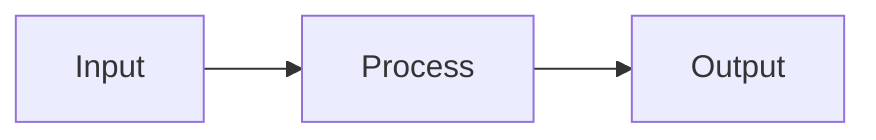

# CLAUDE.md

## Project Overview

This is an AI engineering course teaching from first principles. No frameworks until Module 4 (PydanticAI).

## Course Structure

```
ai-engineer-course/
├── docs/                 # Course outline, templates
├── code/
│   └── python/
│       ├── week-1/       # Module 1: Foundations
│       ├── week-2/       # Module 2: Workflows & Agents
│       ├── week-3/       # Module 3: RAG Fundamentals
│       ├── week-4/       # Module 4: RAG Agent with PydanticAI
│       ├── week-5/       # Module 5: Evals & Monitoring
│       └── week-6/       # Module 6: Deployment
├── lessons/              # Lesson content (gitignored)
│   ├── week-1/
│   ├── week-2/
│   └── ...
└── projects/             # End-of-module projects
```

Each week folder has its own `pyproject.toml` for isolated dependencies.

See `docs/course.md` for full course outline.

## Lesson Structure

Every lesson follows this template (see `docs/lesson-template.md`):

```markdown
# Lesson Title

## What You'll Learn
- Bullet points of outcomes

## Why This Matters
- Real-world context
- How this fits the bigger picture

## Concepts
- Explanation with diagrams/examples
- Keep it practical, not academic

## Code Walkthrough
- Annotated explanation of the example code

## Common Mistakes
- What goes wrong, how to fix it

## Further Reading (Optional)
- Links for those who want depth
```

## Lesson Formatting

Keep formatting minimal for readability:

- Use headings, paragraphs, and lists only
- No excessive bold/italic
- No tables unless comparing options
- Use Mermaid for diagrams (renders on GitHub):



## Reference Documentation

Always consult these docs when writing code examples:

- **OpenAI Responses API**: https://platform.openai.com/docs/api-reference/responses
- **OpenAI Python SDK**: https://pypi.org/project/openai/
- **PydanticAI (Module 4+)**: https://ai.pydantic.dev/
- **OpenAI Embeddings**: https://platform.openai.com/docs/guides/embeddings

## OpenAI Responses API Usage

Use the OpenAI Responses API (NOT Chat Completions) for all API calls. The Responses API is OpenAI's most advanced interface.

**Basic call:**
```python
from openai import OpenAI

client = OpenAI()  # Uses OPENAI_API_KEY from environment

response = client.responses.create(
    model="gpt-5-mini",
    input="Explain what an API is.",
)
print(response.output_text)
```

**System instructions and config:**
```python
response = client.responses.create(
    model="gpt-5-mini",
    input="What's the best programming language?",
    instructions="You are a helpful assistant. Respond in exactly one sentence.",
    temperature=0.0,
)
```

**Structured output with Pydantic:**
```python
from pydantic import BaseModel

class Person(BaseModel):
    name: str
    age: int

response = client.responses.parse(
    model="gpt-5-mini",
    input=[
        {"role": "system", "content": "Extract person information from the text."},
        {"role": "user", "content": "John is 25 years old."},
    ],
    text_format=Person,
)
person = response.output_parsed
```

**Streaming:**
```python
stream = client.responses.create(
    model="gpt-5-mini",
    input="Write a haiku.",
    stream=True,
)
for event in stream:
    print(event)
```

**Tool/Function calling:**
```python
response = client.responses.create(
    model="gpt-5-mini",
    input="What's the weather in Tokyo?",
    tools=[{
        "type": "function",
        "function": {
            "name": "get_weather",
            "description": "Get current weather for a location",
            "parameters": {
                "type": "object",
                "properties": {
                    "location": {"type": "string", "description": "City name"}
                },
                "required": ["location"],
            },
        },
    }],
)
```

**Multi-turn conversations:**
```python
# First turn
response1 = client.responses.create(
    model="gpt-5-mini",
    input="My name is Alice.",
)

# Continue the conversation using previous_response_id
response2 = client.responses.create(
    model="gpt-5-mini",
    input="What's my name?",
    previous_response_id=response1.id,
)
```

**Async:**
```python
from openai import AsyncOpenAI

client = AsyncOpenAI()

response = await client.responses.create(
    model="gpt-5-mini",
    input="Hello",
)
```

**Image inputs:**
```python
response = client.responses.create(
    model="gpt-5-mini",
    input=[
        {
            "role": "user",
            "content": [
                {"type": "input_text", "text": "What is in this image?"},
                {"type": "input_image", "image_url": "https://example.com/image.jpg"},
            ],
        }
    ],
)
```

## API Migration Reference

When updating code from Gemini to OpenAI Responses API:

| Gemini | OpenAI Responses API |
|--------|---------------------|
| `from google import genai` | `from openai import OpenAI` |
| `genai.Client()` | `OpenAI()` |
| `client.models.generate_content()` | `client.responses.create()` |
| `contents="..."` | `input="..."` |
| `config=types.GenerateContentConfig(system_instruction="...")` | `instructions="..."` |
| `response.text` | `response.output_text` |
| `response_mime_type="application/json", response_schema=Model` | `responses.parse(..., text_format=Model)` |
| `gemini-3-flash-preview` | `gpt-5-mini` |
| Message history array | `previous_response_id` |
| `config=types.GenerateContentConfig(tools=[...])` | `tools=[...]` |

## Code Guidelines

### Keep It Simple
- One concept per file
- Under 150 lines preferred
- Demo-friendly (can be run live)

### Python Style
- Python 3.11+
- Type hints on function signatures
- Docstrings on modules and key functions
- snake_case for functions, PascalCase for classes

### Formatting
- ruff format (88 char lines)
- Double quotes
- Imports: stdlib, then third-party, then local

### Comments
- Use section headers:
  ```python
  # =============================================================================
  # Section Name
  # =============================================================================
  ```
- Explain WHY, not WHAT

### Avoid
- Emojis in code or lessons
- f-strings without substitutions
- Unnecessary complexity
- Over-abstraction

## Running Code

```bash
cd code/python/week-1
uv sync
uv run python 02_api_basics.py
```

## Writing Style

All lesson content must follow the writing style guide: `docs/writing-style-guide.md`

Key rules:
- Write like you're talking to a smart friend
- Short paragraphs, one idea each
- Show code first, explain second
- No em dashes, no hedging, no academic tone
- Clear, not clever

## Key Files

- `docs/course.md` - Complete course outline
- `docs/writing-style-guide.md` - How to write lessons
- `code/python/week-*/` - Python code samples
- `lessons/week-*/` - Lesson markdown files (gitignored)
