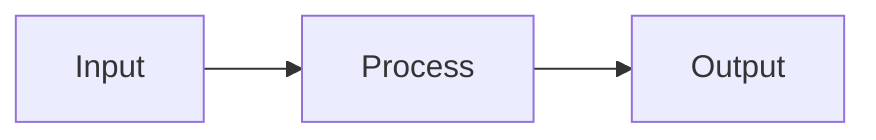

# CLAUDE.md

## Project Overview

This is an AI engineering course teaching from first principles. No frameworks until Module 4 (PydanticAI).

## Course Structure

```
ai-engineer-course/
├── docs/                 # Course outline, templates
├── code/
│   └── python/
│       ├── week-1/       # Module 1: Foundations
│       ├── week-2/       # Module 2: Workflows & Agents
│       ├── week-3/       # Module 3: RAG Fundamentals
│       ├── week-4/       # Module 4: RAG Agent with PydanticAI
│       ├── week-5/       # Module 5: Evals & Monitoring
│       └── week-6/       # Module 6: Deployment
├── lessons/              # Lesson content (gitignored)
│   ├── week-1/
│   ├── week-2/
│   └── ...
└── projects/             # End-of-module projects
```

Each week folder has its own `pyproject.toml` for isolated dependencies.

See `docs/course.md` for full course outline.

## Lesson Structure

Every lesson follows this template (see `docs/lesson-template.md`):

```markdown
# Lesson Title

## What You'll Learn
- Bullet points of outcomes

## Why This Matters
- Real-world context
- How this fits the bigger picture

## Concepts
- Explanation with diagrams/examples
- Keep it practical, not academic

## Code Walkthrough
- Annotated explanation of the example code

## Common Mistakes
- What goes wrong, how to fix it

## Further Reading (Optional)
- Links for those who want depth
```

## Lesson Formatting

Keep formatting minimal for readability:

- Use headings, paragraphs, and lists only
- No excessive bold/italic
- No tables unless comparing options
- Use Mermaid for diagrams (renders on GitHub):



## Reference Documentation

Always consult these docs when writing code examples:

- **Google Gemini SDK**: https://googleapis.github.io/python-genai/
- **Gemini API Guide**: https://ai.google.dev/gemini-api/docs
- **PydanticAI (Module 4+)**: https://ai.pydantic.dev/
- **Embeddings**: https://ai.google.dev/gemini-api/docs/embeddings

## Gemini API Usage

Use the `google-genai` SDK for all API calls.

**Basic call:**
```python
from google import genai
from google.genai import types

client = genai.Client()
response = client.models.generate_content(
    model="gemini-3-flash-preview",
    contents="Explain what an API is.",
)
print(response.text)
```

**System instructions and config:**
```python
response = client.models.generate_content(
    model="gemini-3-flash-preview",
    contents="What's the best programming language?",
    config=types.GenerateContentConfig(
        system_instruction="You are a helpful assistant.",
        temperature=0.0,
    ),
)
```

**Structured output with Pydantic:**
```python
response = client.models.generate_content(
    model="gemini-3-flash-preview",
    contents="Extract the name and age.",
    config=types.GenerateContentConfig(
        response_mime_type="application/json",
        response_schema=Person,
    ),
)
person = Person.model_validate_json(response.text)
```

**Streaming:**
```python
for chunk in client.models.generate_content_stream(
    model="gemini-3-flash-preview",
    contents="Write a haiku.",
):
    print(chunk.text, end="")
```

**Tool calling (automatic):**
```python
response = client.models.generate_content(
    model="gemini-3-flash-preview",
    contents="What time is it in Tokyo?",
    config=types.GenerateContentConfig(
        tools=[my_function],  # Pass Python functions directly
    ),
)
```

**Async:**
```python
response = await client.aio.models.generate_content(
    model="gemini-3-flash-preview",
    contents="Hello",
)
```

## Code Guidelines

### Keep It Simple
- One concept per file
- Under 150 lines preferred
- Demo-friendly (can be run live)

### Python Style
- Python 3.11+
- Type hints on function signatures
- Docstrings on modules and key functions
- snake_case for functions, PascalCase for classes

### Formatting
- ruff format (88 char lines)
- Double quotes
- Imports: stdlib, then third-party, then local

### Comments
- Use section headers:
  ```python
  # =============================================================================
  # Section Name
  # =============================================================================
  ```
- Explain WHY, not WHAT

### Avoid
- Emojis in code or lessons
- f-strings without substitutions
- Unnecessary complexity
- Over-abstraction

## Running Code

```bash
cd code/python/week-1
uv sync
uv run python 02_api_basics.py
```

## Writing Style

All lesson content must follow the writing style guide: `docs/writing-style-guide.md`

Key rules:
- Write like you're talking to a smart friend
- Short paragraphs, one idea each
- Show code first, explain second
- No em dashes, no hedging, no academic tone
- Clear, not clever

## Key Files

- `docs/course.md` - Complete course outline
- `docs/writing-style-guide.md` - How to write lessons
- `code/python/week-*/` - Python code samples
- `lessons/week-*/` - Lesson markdown files (gitignored)
